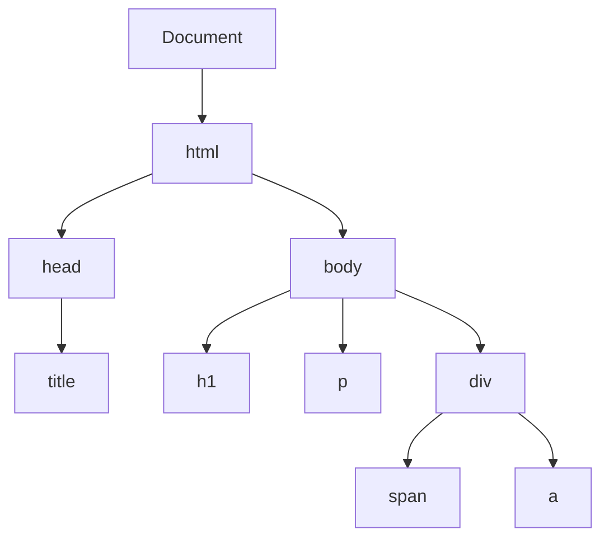

# Javascript DOM

## HTML DOM Tree Flowchart



## Finding HTML Element

- `getElementById`: method to get inner html elements of a div ID
- `getElementsByTagName`
- `getElementsByClassName`

## Changing Property

- `innerHTML`: elements inside of a ID
- `attribute`
- `style.property`
- `setAttribute`

## Adding and Removing Elements

- `createElement`
- `removeChild`
- `appendChild`
- `replaceChild`
- `write`

## Events Handler

You can call javascript functions to perform any task on html evens listed [here](./js-keyword.md#html-event-handlers)

## Event Listener

`addEventListner()` method 

```html
<html>
<body>

<p id="demo"></p>

<script>
document.getElementById("demo").innerHTML = "Hello World!";
</script>

</body>
</html>
```

- `getElementsByTagName`
- `getElementsByClassName`
